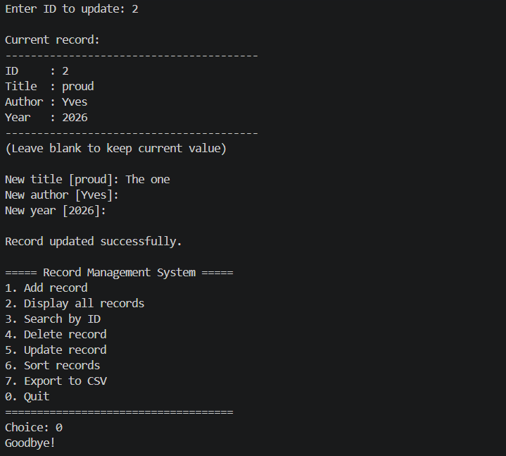

# Record Management System

A file-based CLI application to manage book records with add, search, edit, delete, sort, and export functionality. Written in C++ using OOP principles.

## Features

- Add a book record (ID auto-generated)
- Display all records in a formatted table
- Search a record by ID
- Delete a record with confirmation
- Update a record field by field
- Sort records by title or by year
- Export all records to CSV format
- Input validation and error handling throughout

## Architecture

```
Record-Management-System/

├── main.cpp                  # Entry point + CLI menu
├── include/
│   ├── Book.h                # Book struct (ID, title, author, year)
│   └── record_manager.h      # Function declarations
├── src/
│   └── record_manager.cpp    # All function implementations
└── data/
├── books.txt             # File-based storage (auto-generated)
└── export.csv            # CSV export (auto-generated)

```

## Requirements

- g++ compiler (C++17 or later)
- Windows / Linux / macOS

## How to compile

```bash
g++ main.cpp src/record_manager.cpp -o app
```

## How to run

```bash
# Windows
app.exe

# Linux / macOS
./app
```

## Menu options

| Option | Action |
|--------|--------|
| 1 | Add a new book record |
| 2 | Display all records |
| 3 | Search by ID |
| 4 | Delete a record |
| 5 | Update a record |
| 6 | Sort records (by title or year) |
| 7 | Export to CSV |
| 0 | Quit |

## Data format

Records are stored in `data/books.txt` using pipe-separated values:
ID|Title|Author|Year

## Screenshot


